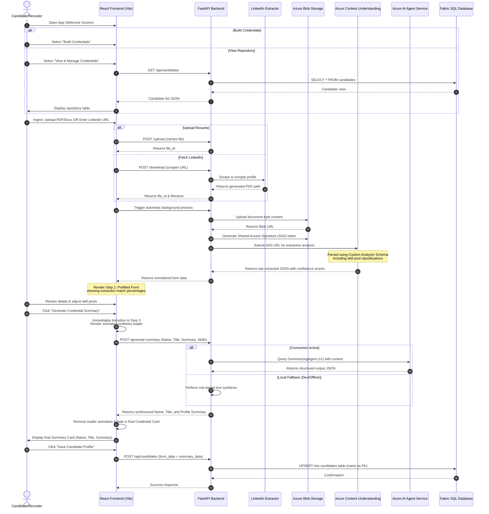

# Credential Builder

An automated, premium enterprise platform designed to ingest candidate resumes/documents or LinkedIn profiles, extract structured credentials, edit prefilled details, and generate synthesized professional summaries.

---

## Entire Workflow Architecture

The platform orchestrates document processing across multiple services, APIs, and cloud engines. Below is the step-by-step workflow:



### 1. Ingestion Phase (Step 1)
- **Resume Upload**: Resumes (.pdf or .docx) are transmitted via multipart request to the backend `/upload` route and cached in-memory.
- **LinkedIn Download**: Public LinkedIn URLs are sent to the `/download` route, which delegates to the scraper service to parse layout timelines and export a local document PDF.

### 2. Cloud Storage & Authorization Pipeline
- The frontend immediately chains the cached reference through `/azure/upload`.
- The backend uploads file contents to the Azure Blob Storage container (`uploaded-files`).
- Generates a **Shared Access Signature (SAS) token** specifying read-only access (expiring in 1 hour) to grant secure access to Azure's extraction engine.

### 3. Azure Content Understanding Extraction
- The backend submits the SAS URL to the Azure Content Understanding client library.
- The document is parsed against a custom schema (`CredentialsBuilderAnalyser`) which extracts identity headers, career descriptions, and maps skills to target classification pools (e.g. Tax, Deals, Technology) based on enum matches.
- Extracted parameters are mapped back into camelCase React-friendly states.

### 4. Review & Form Adjustments (Step 2)
- The React application renders the fields in an interactive editor.
- Next to the **Title**, **Core Competencies**, and **Key Expertise** fields, the UI displays match percentage badges indicating the extraction confidence score.
- Users can review, append text list elements, and adjust matched skill pools.

### 5. AI Synthesis Loader (Step 3 Prep)
- Upon clicking *"Generate Credential Summary"*, the app immediately shifts the timeline to Step 3.
- Renders the `AISynthesisLoader` component, displaying a shimmering skeleton layout card and cycling status updates (e.g., *"Structuring executive summary layout..."*, *"Formulating profile overview paragraph..."*) to communicate background activity.

### 6. Azure AI Agent Synthesis
- In the background, a payload containing the candidate's name, title, current summary, competencies, and expertise is posted to `/generate-summary`.
- The backend initializes `AIProjectClient` to query the `SummarizingAgent` (version `1`).
- Prompts the agent to synthesize details into a high-impact executive summary and requests a structured JSON format.
- If credentials or endpoints are unavailable, a rule-based fallback synthesizes the paragraph automatically.

### 7. Save & Repository (Step 3 → Fabric SQL)
- Once the summary card is rendered, the recruiter clicks **Save Candidate Profile**.
- The backend upserts the candidate record (name, title, profile picture, full form data, and summary data) into the `candidates` table in Microsoft Fabric SQL Database — with `name` as the **primary key**.
- From the **View & Manage Credentials** landing screen, recruiters can list all saved profiles, view full summary cards in a modal, reload a profile back into the editing form, or permanently delete records.

---

## Prerequisites

Before setting up the project, ensure the following are installed and configured on your Mac:

- **Python 3.11+** (Anaconda or system Python)
- **Node.js 18+** and `npm`
- **Google Chrome** (for LinkedIn Selenium scraper)
- **Azure CLI** (`az`) — required for Entra ID token-based database authentication
  ```bash
  brew install azure-cli
  az login  # Complete MFA in browser; token is cached for the server
  ```
- **Microsoft ODBC Driver 18 for SQL Server** — required for Fabric SQL connectivity
  ```bash
  brew tap microsoft/mssql-release https://github.com/microsoft/homebrew-mssql-release
  brew trust microsoft/mssql-release
  HOMEBREW_ACCEPT_EULA=Y brew install msodbcsql18 mssql-tools18
  ```

---

## Setup & Startup Instructions

### 1. Configuration (.env)
Create a `.env` file in the root workspace folder with the following variables:
```ini
# Azure Blob Storage
AZURE_STORAGE_CONNECTION_STRING=your_azure_storage_connection_string
AZURE_STORAGE_CONTAINER_NAME=uploaded-files

# Azure Content Understanding
AZURE_CONTENT_UNDERSTANDING_ENDPOINT=your_content_understanding_endpoint
CONTENT_UNDERSTANDING_KEY=your_content_understanding_api_key
ANALYZER_ID=your_analyzer_model_id

# LinkedIn Extractor service URL
LINKEDIN_EXTRACTOR_URL=http://localhost:8000

# Microsoft Fabric SQL Database (leave empty to use local SQLite fallback)
SQL_CONNECTION_STRING="Driver={ODBC Driver 18 for SQL Server};Server=your-fabric-endpoint.database.fabric.microsoft.com,1433;Database={your-database-name};Encrypt=yes;TrustServerCertificate=no"

# Required on macOS when using Homebrew-installed ODBC driver
ODBCSYSINI="/opt/homebrew/etc"
```

> **Note on authentication**: When `SQL_CONNECTION_STRING` is set, the backend uses `DefaultAzureCredential` (powered by your `az login` token) to authenticate silently. Run `az login` once in your terminal before starting the server. If `SQL_CONNECTION_STRING` is omitted, the app automatically falls back to a local SQLite database (`backend/candidates.db`).

### 2. Run All Services
A helper script is provided to automatically boot all services (LinkedIn Scraper, Backend, and Frontend Dev Server):
```bash
./start_all.sh
```
This starts:
- **LinkedIn Extractor** on port `8000`
- **FastAPI Backend** on port `8001`
- **React Frontend** on port `5173`/`5174`
