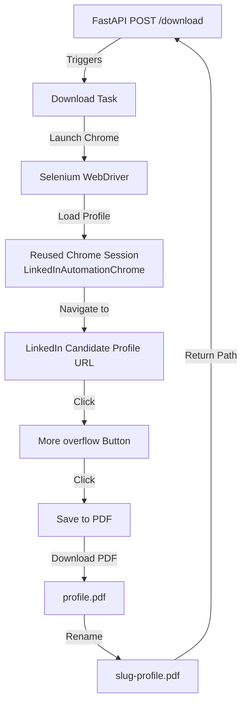

# LinkedIn Profile Scraper Service

A FastAPI microservice that automates a headless Chrome browser to fetch and download LinkedIn profiles as PDF documents.

## How it is Automated to Fetch

The service uses **Selenium** with **WebDriver Manager** to control a headless Chrome instance and simulate user interactions to retrieve profiles:



### Automation Workflow
1. **Authenticated Session Reuse**: 
   - Launches Chrome using a dedicated local Chrome user data directory path: `/Users/bhuvanps/LinkedInAutomationChrome`.
   - By specifying a profile directory (`Default`), the browser reuses cookies and session tokens from a previous user login, allowing the automation to bypass standard LinkedIn login screens and access profile details directly.
2. **Headless Execution**: 
   - Starts in `--headless=new` mode, enabling the script to run in the background without launching a visible browser GUI.
3. **Element Navigation**: 
   - Navigates directly to the target candidate's LinkedIn URL (e.g., `https://www.linkedin.com/in/varshini-munibasappa-sreedhara`).
   - Dynamically scans buttons to locate the **"More"** overflow trigger and simulates a click event via JavaScript.
4. **Export Action**:
   - Locates the **"Save to PDF"** menu item inside the dropdown and triggers the download mechanism.
5. **File Handling**:
   - The browser downloads `profile.pdf` to the local `downloads/` directory.
   - The script waits for the download to complete, renames it to the candidate's name slug (e.g. `varshini-munibasappa-sreedhara-642a45210.pdf`), and returns the file path to the backend orchestrator.

---

## File Structure

```
linkedin-extract/
├── server.py              # FastAPI server routes mapping
├── linkedin_downloader.py # Selenium browser automation wrapper script
├── requirements.txt      # Scraper package dependencies
└── downloads/            # Local directory where generated profile PDFs are saved
```

## Running Locally

1. Install requirements:
   ```bash
   pip install -r requirements.txt
   ```
2. Start the service:
   ```bash
   python3 -m uvicorn server:app --reload --host 0.0.0.0 --port 8000
   ```
   *Note: Ensure Google Chrome is installed on the host operating system.*
